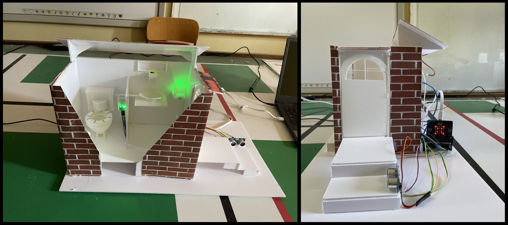

# Shared Eco-Smart Restroom

<h2 align= center>Έργο για συμμετοχή στο 7ο Πανελλήνιο Διαγωνισμό Ανοιχτών Τεχνολογιών στην Εκπαίδευση:   Ανοιχτή Σχεδίαση για έναν Άμεσο Δημόσιο Χώρο</h2>

  

Η ομάδα ρομποτικής του σχολείου μας 2ο ΕΠΑΛ / ΕΚ Αγρινίου αντιλαμβανόμενη των προβλημάτων που υπάρχουν σε κοινόχρηστες τουαλέτες, προτείνει μια υλοποίηση όπου θα παρέχονται όλοι εκείνοι οι αυτοματισμοί που θα διασφαλίζουν θέματα υγιεινής και οικολογίας.
Συγκεκριμένα η ενέργεια για τη λειτουργία των αυτοματισμών θα παράγεται από Φ/Β σύστημα. Μέρος του νερού από το πλύσιμο των χεριών μπορεί να χρησιμοποιηθεί στο καζανάκι. Θα υλοποιηθούν αυτοματισμοί ούτως ώστε ο χρήστης της τουαλέτας να μην χρειάζεται να ακουμπήσει κανένα αντικείμενο (πόρτα, βρύση, καλαθάκι κ.ο.κ.).

Υλικά που θα χρειαστούμε :
<ul>
  <li> BBC Micro:bit V2 Board x 3 </li>
  <li> Edge Connector Breakout Board x 2 </li>
  <li> Terminal Block Breakout x 1 </li>
  <li> Πλακέτα Δοκιμών x 3 </li>
  <li> Jumper Wires F-M x 2 </li>
  <li> Jumper Wires 15cm Μ-Μ x 2 </li>
  <li> Ribbon 40wire 20cm - Female to Μale x 2 </li>
  <li> Ribbon 40wire 20cm - Male to Male x 2 </li>
  <li> Street Light for BBC micro:bit x 1 </li>
  <li> Servo (μικρά) x 3 </li>
  <li> Linear Actuator Kit x 1 </li>
  <li> Ultrasonic Sensor x 1 </li>
  <li> 3D Printer Filament x 1 </li>
  <li> LED Diffused 5mm Green (Prewired) x 3 </li>
  <li> LED Diffused 5mm Red (Prewired) x 3 </li>
  <li> LED Diffused 5mm Blue (Prewired) x 3 </li>
  <li> Photo Resistor LDR 5mm x 3 </li>
  <li> LED Light Pipe 5mm Round - 15.9mm x 5 </li>
  <li> Waveshare Flame Sensor x 2 </li>
  <li> IR Break Beam Sensor x 2 </li>
  <li> Tact switch 6x3mm 4.3mm 2pin Angled x 10 </li>
  <li> Solar Panel 0.8W 70x90mm x 1 </li>
</ul>
Συνολικό κόστων υλικών 185€

  

  

 
